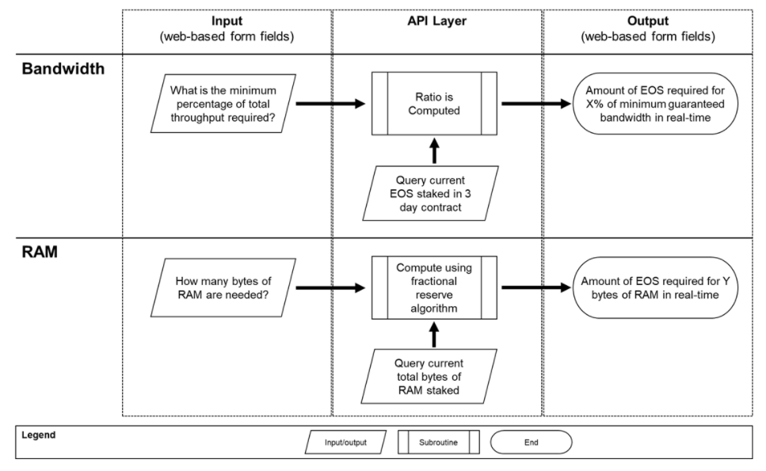
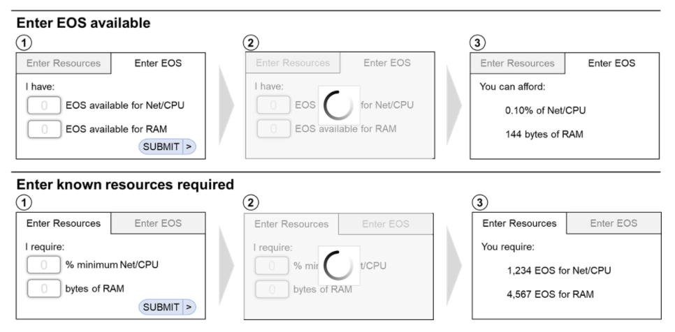

# ERP

## Simple is Powerful: The EOS Resource Planner

EOS has the limitless potential to empower us to tackle some of the most important issues we face as a global society. But before we secure life, liberty, and property, the community must develop the tools to help answer the basic questions. No matter what their goal, every developer will start with a single question when building on the EOS.IO platform, “How many EOS tokens do I need to power my idea?”. 

EOS New York is developing a tool that will answer this question. The EOS Resource Planner, or ERP, will be both a standalone and modular service that will be queryable by anyone in order to understand, at that point in time, the amount of staked tokens needed to secure desired resources. Yes, it will be centrally available at (www.eosrp.io)[http://eosrp.io] (under construction) but for convenience only. The code will be open source and can be used anywhere by anyone

At this time, accurate resource estimates will not be available until the network is launched. Per the EOS.IO whitepaper, “Block producers publish their available capacity for bandwidth, computation, and state.” (source)[https://github.com/EOSIO/Documentation/blob/master/TechnicalWhitePaper.md#token-model-and-resource-usage]. We anticipate all Block Producers to comply and make accessible their network statistics to help power this tool. 

## Phased Approach

Below is the “features-in-phases” approach for deploying the EOS Resource Planner.

* Phase 1 (Available near launch): Point-in-time estimate of EOS tokens required for X resources <> Point-in-time estimate of resources afforded from Y EOS tokens.

* Phase 2 (Q4 2018): Average look-back window of additional resources afforded based on fractional reserve system.

* Phase 3 (Pending Chintai Development): Average lease price of Y EOS tokens available. 

* Phase 4 (Pending EOS Ecosystem): Multi-chain resource estimation.

## Process Flows and Interfaces (illustrative)

Below are a flowchart and sample user interface design which visualizes the intended direction of the EOS Resource Planner:

### Process Flow
*For illustrative purposes only*

### Sample User Interface
*For illustrative purposes only*

